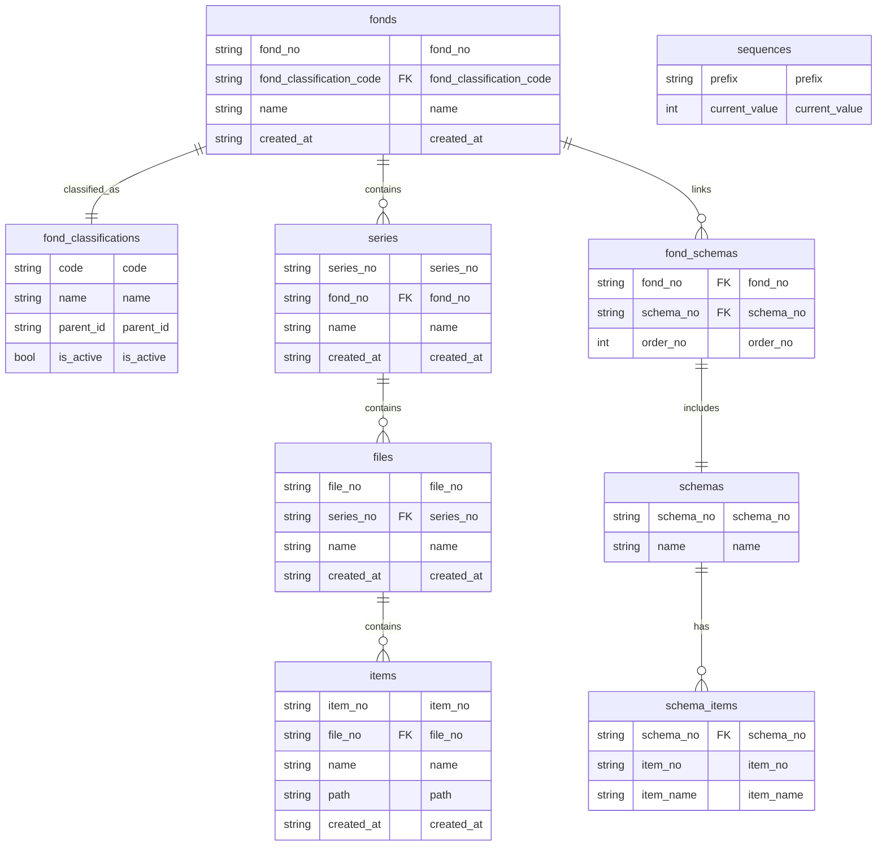

# FondsPod

FondsPod is an open-source document management tool based on archival management principles. It helps users efficiently organize, store, and retrieve various types of documents and files.

## Features

- **Archive Library Management**: Create and manage multiple archive libraries, each associated with a local directory. Archive libraries are collections of Fonds, and each library is linked to a local SQLite database (`.fondspod.db`) for metadata storage.
- **Fonds Management**: Organize documents into hierarchical structures:
  - **Fonds**: The highest level of archival management.
  - **Series**: Subsets under Fonds for further classification.
  - **Files**: Collections of documents under Series.
  - **Items**: Specific entries within Files.
  Fonds are classified using `FondClassifications`, and their metadata includes creation time and classification codes.
- **Schema Management**: Define and manage metadata structures for Series. Schemas have two levels:
  - **Schema**: Represents the metadata structure.
  - **Schema Items**: Represents individual fields within a Schema. A special `Year` schema is initialized by default and cannot be modified.
- **File Management**: Add, delete, and organize files within Series. File identifiers are generated using the format `[FondNo]-[SeriesNo]-[Two-digit Sequence Number]`. Deleted files are moved to a `.trash` directory to prevent accidental loss.
- **Settings**: Configure themes (e.g., light/dark mode), languages (e.g., Chinese, English), and archive paths. Settings are stored in user configuration files.
- **Internationalization**: Supports multiple languages (Chinese, English). Translations are managed using Slint's `@tr()` macro and Fluent files.

### Additional Features

- **Number Generation**: Unique identifiers for Fonds, Series, Files, and Items are generated using a prefix and sequence number stored in the `Sequences` table. The sequence number format is configurable (default: 2 digits).
- **Dynamic Series Generation**: Series are dynamically generated based on the Cartesian product of Schema Items. For example, selecting `Year` (2020, 2021) and `Department` (HR, IT) results in Series like `2020-HR`, `2020-IT`, `2021-HR`, `2021-IT`.

## Installation

1. Install Rust from [rust-lang.org](https://www.rust-lang.org/learn/get-started).
2. Clone the repository:
   ```bash
   git clone https://github.com/Sudiaty/fonds_pod.git
   cd fonds_pod
   ```
3. Build and run:
   ```bash
   cargo build
   cargo run
   ```

## Architecture

FondsPod uses MVVM architecture

## Development Plan

FondsPod adopts a hierarchical structure for document management:

- **Fonds**: The highest level of archival management.
- **Series**: Subsets under Fonds for further classification.
- **Files**: Collections of documents under Series.
- **Items**: Specific entries within Files.

### SQLite Schema

The database schema includes tables for Fonds, Series, Files, Items, and their relationships. Metadata is stored in `.fondspod.db` files.



### Key Modules

1. **Archive Library Management**: Create and manage archive libraries.
2. **Schema Management**: Define metadata structures for Series.
3. **File Management**: Add, delete, and organize files.
4. **Settings**: Configure themes, languages, and archive paths.

## Internationalization

Supports Chinese (zh-CN) and English (en-US). Translations are managed using Slint's `@tr()` macro and Fluent files.

## License

MIT License