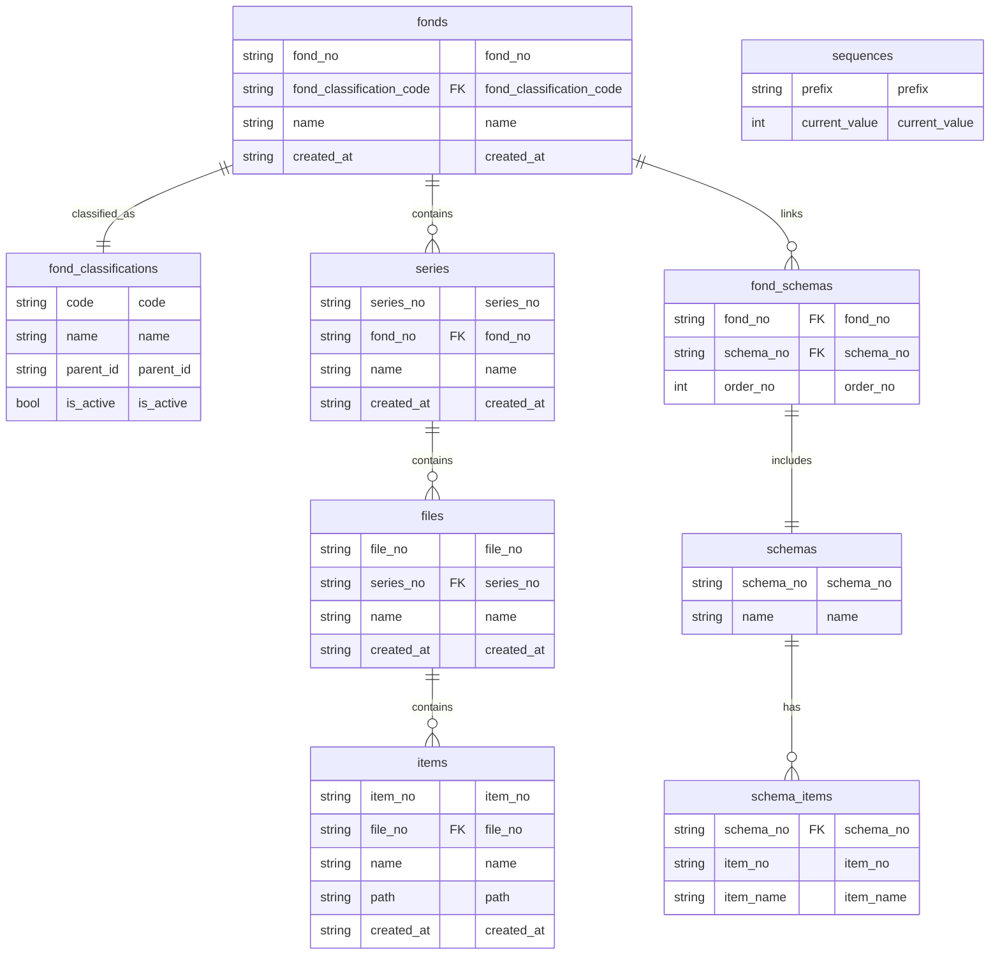

# FondsPod

FondsPod 是一个基于档案管理思想的开源文档管理工具。它旨在帮助用户高效地组织、存储和检索各种类型的文档和文件。

## 功能特性

- **档案库管理**：创建和管理多个档案库，每个档案库关联一个本地目录。档案库是全宗的集合，每个档案库关联一个本地 SQLite 数据库（`.fondspod.db`）用于元数据存储。
- **全宗管理**：将文档组织为层级结构：
  - **全宗（Fonds）**：档案管理的最高层级。
  - **案卷（Series）**：全宗下的子集，用于进一步分类。
  - **文件（Files）**：案卷下的文档集合。
  - **件（Items）**：文件中的具体条目。
  全宗通过 `FondClassifications` 进行分类，其元数据包括创建时间和分类代码。
- **Schema 管理**：定义和管理案卷的元数据结构。Schema 分为两级：
  - **Schema**：表示元数据结构。
  - **Schema Items**：表示 Schema 中的具体字段。默认初始化一个特殊的 `Year` Schema，不可修改。
- **文件管理**：在案卷中添加、删除和组织文件。文件编号格式为 `[FondNo]-[SeriesNo]-[两位流水号]`。删除的文件会移动到 `.trash` 目录以防止误删。
- **设置**：配置主题（如浅色模式、深色模式）、语言（如中文、英文）和档案路径。设置以用户配置文件的形式存储。
- **国际化**：支持多种语言（中文、英文）。翻译通过 Slint 的 `@tr()` 宏和 Fluent 文件管理。

### 其他特性

- **编号生成**：为全宗、案卷、文件和件生成唯一编号，编号格式为前缀加流水号，流水号存储在 `Sequences` 表中，默认格式为 2 位数字。
- **动态案卷生成**：根据 Schema Items 的笛卡尔积动态生成案卷。例如，选择 `Year`（2020, 2021）和 `Department`（HR, IT），会生成案卷 `2020-HR`、`2020-IT`、`2021-HR`、`2021-IT`。

## 安装

1. 从 [rust-lang.org](https://www.rust-lang.org/learn/get-started) 安装 Rust。
2. 克隆仓库：
   ```bash
   git clone https://github.com/Sudiaty/fonds_pod.git
   cd fonds_pod
   ```
3. 构建并运行：
   ```bash
   cargo build
   cargo run
   ```

## 架构

FondsPod 使用MVVM架构

## SQLite 数据库架构

数据库架构包括 Fonds、Series、Files、Items 表及其关系。元数据存储在 `.fondspod.db` 文件中。



## 许可证

MIT 许可证